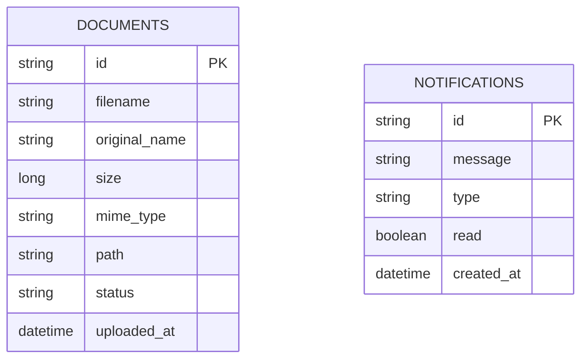

# MyDocs — Document Management Dashboard

Full-stack assessment project: PDF upload (single + bulk), per-file progress, SSE notifications, and a persistent notification center.

**Stack:** React 18 + Vite + MUI · Spring Boot 3 + JPA · H2 (local) · MySQL (production)

---

## Features (assessment checklist)

| Feature | Status |
|--------|--------|
| Single & bulk PDF upload (drag-and-drop) | Done |
| Per-file progress bar, size, type, status | Done |
| Document table with download & delete | Done |
| Bulk (>3): background toast + SSE + DB notification | Done |
| ≤3 files: inline progress only (no extra notification) | Done |
| Notification panel + unread badge (from API) | Done |
| SSE works app-wide (not only on upload page) | Done |
| Livvic font + blue/white MUI theme | Done |
| Unit tests | Optional (not included) |

---

## Quick start (local)

### Prerequisites
- Java 17+
- Maven 3.9+
- Node.js 18+

### 1. Backend
```bash
cd backend
mvn spring-boot:run
```
- API: http://localhost:8080
- H2 console: http://localhost:8080/h2-console

**H2 login (must match exactly):**
| Field | Value |
|-------|--------|
| JDBC URL | `jdbc:h2:mem:mydocsdb` |
| User | `sa` |
| Password | *(empty)* |

```sql
SHOW TABLES;
SELECT * FROM DOCUMENTS;
SELECT * FROM NOTIFICATIONS;
```

### 2. Frontend
```bash
cd frontend
npm install
npm run dev
```
- App: http://localhost:5173

Optional: copy `frontend/.env.example` → `frontend/.env` and set `VITE_API_URL`.

---

## API endpoints

| Method | Path | Description |
|--------|------|-------------|
| POST | `/api/upload` | Multipart `files[]` (PDF only) |
| GET | `/api/documents` | List documents |
| GET | `/api/documents/{id}/download` | Download file |
| DELETE | `/api/documents/{id}` | Delete file |
| GET | `/api/notifications` | List notifications |
| PATCH | `/api/notifications/{id}/read` | Mark one read |
| PATCH | `/api/notifications/read-all` | Mark all read |
| GET | `/api/events` | SSE stream |

---

## Database schema (ERD)



Files are stored on disk under `backend/uploads/`. Metadata lives in the database.

---

## Deploy (Railway + Vercel)

### Backend — Railway
1. Push repo to GitHub.
2. [Railway](https://railway.app) → New Project → Deploy from GitHub → select repo.
3. Set **Root Directory** to `backend`.
4. Add **MySQL** plugin; Railway injects `MYSQL_URL` / credentials.
5. Variables (example):
   - `SPRING_PROFILES_ACTIVE=prod`
   - Map DB URL to Spring (Railway MySQL JDBC URL), e.g.  
     `SPRING_DATASOURCE_URL=jdbc:mysql://HOST:3306/railway?...`
   - `SPRING_DATASOURCE_USERNAME=...`
   - `SPRING_DATASOURCE_PASSWORD=...`
6. Note the public URL, e.g. `https://mydocs-backend.up.railway.app`.

### Frontend — Vercel
1. Import repo on [Vercel](https://vercel.com).
2. **Root Directory:** `frontend`
3. Build: `npm run build` · Output: `dist`
4. Environment variable:
   - `VITE_API_URL=https://your-railway-backend-url` (no trailing slash)
5. Deploy.

### Switch to MySQL locally
```bash
# Use prod profile (see backend/src/main/resources/application-prod.properties)
cd backend
mvn spring-boot:run -Dspring-boot.run.profiles=prod
```
Ensure MySQL is running and database `mydocsdb` exists (or `createDatabaseIfNotExist=true`).

---

## Project structure

```
mydocs/
├── backend/          Spring Boot API, uploads/, H2/MySQL
├── frontend/         React + Vite + MUI
└── README.md
```

---

## Git workflow (assessment)
Commit every ~15 minutes with meaningful messages. Example history:
- scaffold → JPA → backend API → frontend upload → notifications → polish → hosting
